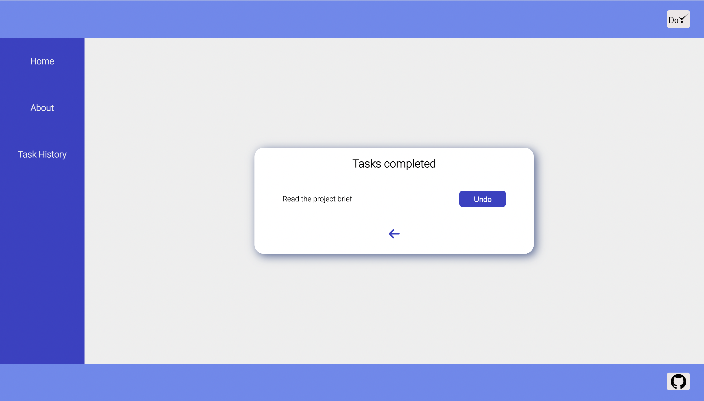

# To-Do app
<!-- ## [Check the APP!](deployed link here) note: once we deploy the app lets link it -->

# Project Description

In this collaborative project we created a simple SPA in React: a To-Do app which allows the user to create and manage tasks, as well as check off (or uncheck) the existing tasks when completed.

# App Functionalities 

The To-Do app contains 3 different pages:

## Home Page 

The Home Page is the first screen that the active user sees when openening the app. This page displays a list of tasks which were previously created by the user. Besides offering an overview of the created tasks list, this page allows the user to edit or delete the existing tasks, and add new tasks. When clicking on the task text, the user is led to a dynamic page that displays the task details, namely, the name and status of completion.

## Task History Page 

As mentioned above, the user has the choice to delete the completed or unwanted tasks from the task list. Once the user deletes a task, the task is moved to the Task History Page, which the user can acces through the sidebar. In the Task History page, the user has an overview of the deleted tasks. This page offers the user the choice to undo the task and update it as an active task again in the task list.

## About Page 

The About Page displays a little bit of information about the team (Noelia, Hristina, Marine) who built the app.

## Backlog Functionalities

- Add a descrition box for the tasks.
- Add a level of urgency and prioritize the tasks accordingly.
- Add an option with a calender where the user can set a deadline for finishing the task.
 
# Technologies Used
- React
- CSS

# Extra Links 

### Slides
[Link](https://docs.google.com/presentation/d/1MjfAwMPSK35rCAN8oYT9O7VOGWk-ixrmc2uwcN1P-w0/edit#slide=id.p2)

## Repo
[Link](https://github.com/niranzri/react-app)